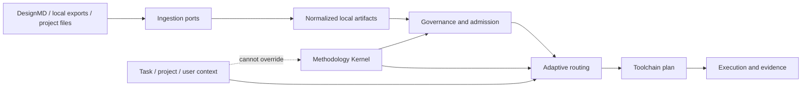
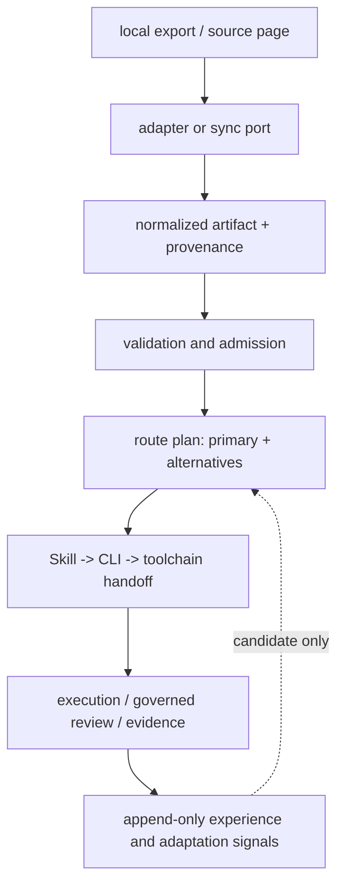

# Architecture Spine — Design Pipeline

## Design Paradigm

Design Pipeline is a local-first, invariant-first pipeline. Each layer has a narrow responsibility and may depend only on layers below it:

1. **Sources and ports** — DesignMD pages, local design exports, project files, and controlled host input.
2. **Ingestion** — bounded discovery/fetch or local-file intake; no remote code execution.
3. **Normalized artifacts** — content, metadata, provenance, hashes, mappings, and receipts in deterministic local formats.
4. **Governance** — license, safety, containment, completeness, and admission status.
5. **Adaptive orchestration** — task/project/user context selects and sequences capabilities without changing the Methodology Kernel.
6. **Routing and toolchain** — one primary route becomes an owner-bound, hash-bound executable or governed-review plan.
7. **Execution and evidence** — lifecycle state, outputs, and verification evidence are emitted locally.

The Methodology Kernel and project constraints are cross-cutting authorities. They may constrain every layer, but no runtime layer may rewrite them. The product surface is Skill + CLI + filesystem; MCP is outside this architecture.

## Brownfield Delivery Boundary

The existing code already provides the local catalog shape, bounded page/concurrency traversal, atomic last-known-good publication for tested partial syncs, primary-route selection, and provider-neutral receipt validation. The following are architecture obligations, not claims that the current slice is complete: robots and response-byte enforcement, URL/redirect safety, realpath-safe path checks, all-failure recovery envelopes, source-artifact hash propagation, executable-versus-agent route readiness, and actual Figma/Penpot importers. `SM-4` remains unearned until a real local importer fixture passes.

## Invariants & Rules

### AD-1 — Local-first runtime boundary [ADOPTED]

- **Binds:** all capabilities; FR-1 through FR-10
- **Prevents:** an accidental MCP service, hosted dependency, or remote runtime becoming required for ordinary execution
- **Rule:** Runtime dependencies are local Skill code, CLI processes, project files, and declared local tools. Network access is an optional ingestion input and never an execution dependency.

### AD-2 — Source authority and inert resource admission [ADOPTED]

- **Binds:** FR-1, FR-3, FR-4, FR-7; UJ-1 and UJ-3
- **Prevents:** treating a directory card, scraped page, or external repository as trusted executable knowledge
- **Rule:** Every external resource enters as a local record containing a sanitized source URL, kind, content path, content hash, license/status, and provenance. First-party DesignMD pages may become entries; links to external tools are retained as inert references unless a separate source-admission decision grants them entry status. The default admission is `reference-only`; hydrate, install, and execute require an explicit governed flow outside the MVP spine.

### AD-3 — Bounded discovery and fetch [ADOPTED]

- **Binds:** FR-1, FR-2, FR-9, SM-1
- **Prevents:** unbounded crawling, silent omission, high-frequency requests, or reporting a partial catalog as complete
- **Rule:** Discovery may use HTML, sitemap, and `llms` indexes. Sync must honor `robots.txt`, enforce page/concurrency/timeout/response-byte limits, deduplicate by canonical URL, and surface `blocked` or `partial` outcomes with per-source errors. Before fetch, reject URL userinfo and sensitive query parameters; reject loopback, link-local, private, and metadata targets by default; and re-check every redirect against the same origin policy. Fetch policy failure is visible, never silently permissive.

### AD-4 — Atomic snapshot with last-known-good recovery [ADOPTED]

- **Binds:** FR-2, FR-9, FR-10, SM-5
- **Prevents:** one failed sync destroying a usable local catalog or leaving a half-written snapshot
- **Rule:** Build a candidate snapshot in a temporary location, validate it, then publish atomically. On fetch, parse, write, or all-page failure, preserve the last valid snapshot and emit a deterministic recovery envelope containing status, errors, preserved flag, and previous snapshot hash.

### AD-5 — Contained local paths [ADOPTED]

- **Binds:** FR-3, FR-4, FR-5; all persisted artifact readers
- **Prevents:** traversal, absolute-path injection, and symlink-based escape from the project artifact root
- **Rule:** Catalog `contentPath` values are catalog-root-relative; tool receipts and project artifacts are project- or evidence-root-relative, with the base named in their envelope. Every read/write resolves the root and target through a realpath-aware containment guard, rejects symlink/junction escape and non-file targets, and treats failure as `invalid`.

### AD-6 — Provider-neutral design-tool receipt [ADOPTED]

- **Binds:** FR-5, FR-6, FR-7, SM-4
- **Prevents:** provider APIs or vendor-specific object models leaking into routing and execution
- **Rule:** A tool adapter accepts a local export or controlled host input and emits a receipt with provider, operation, source mode, producer/version, source hash, normalized mappings, editable flag, fidelity/loss evidence, and evidence paths. Import validation requires the declared root, regular-file checks, and byte-hash equality; logical `sourceLocations` cannot contain filesystem traversal. The receipt is provider-neutral, but Figma and Penpot input formats remain provider-specific: v1 stories must explicitly choose local raster/vector exports, controlled plugin exports, or a safe local archive. No API, login, or writeback is required for the local-export path.

### AD-7 — One primary route and explicit specificity [ADOPTED]

- **Binds:** FR-8, UJ-3, SM-3
- **Prevents:** competing owners, generic fallback hiding a requested capability, or a route that cannot explain why it won
- **Rule:** Each route plan has exactly one `primaryRouteId`. Explicit capability or keyword routes outrank generic routes. The plan records matched capability, alternatives, routing context, and the owner that must receive the next handoff.

### AD-8 — Review and blocked states propagate [ADOPTED]

- **Binds:** FR-4, FR-6, FR-8, FR-10; SM-3 and SM-C2
- **Prevents:** an unverified, licensed, commercial, or review-only path being presented as executable `ready`
- **Rule:** `review`, `blocked`, `invalid`, and `fidelity-mismatch` are terminal for the current execution attempt. Toolchain and execution consume the same state; they may produce a governed-review probe, but may not silently downgrade it to `ready`. `ready` means the selected primary has a real executable lifecycle; agent-owned or manual handoff uses a distinct non-executable status and a required Skill action/evidence checkpoint.

### AD-9 — Hash and owner binding across handoff [ADOPTED]

- **Binds:** FR-3, FR-7, FR-8, FR-10, SM-2, SM-3
- **Prevents:** stale artifacts, wrong-owner delivery, or Skill → CLI → toolchain drift
- **Rule:** Source/artifact hash, admission status, route id, primary owner, and execution input hash are carried through every handoff and included in the plan hash. Any input, owner, route, or hash mismatch rejects the handoff with a stable error envelope.

### AD-10 — Context selects; Kernel governs [ADOPTED]

- **Binds:** adaptive orchestration, UJ-3, safety and data governance NFRs
- **Prevents:** user modeling or project preferences overriding methodology, safety, licensing, or route gates
- **Rule:** Context precedence is `task > project > user > defaults`. Durable context is finite, auditable, and shadow-mode only. Store collaboration preferences and validated signals, never raw transcripts, secrets, sensitive inferences, or personality labels. Context cannot change Kernel rules or admission status.

### AD-11 — Explicit state ownership [ADOPTED]

- **Binds:** all cross-cutting state and recovery paths
- **Prevents:** hidden mutation and circular writes between ingestion, routing, adaptation, and execution
- **Rule:** Source snapshots own immutable source state; governance owns admission; adaptation owns versioned atomic state plus append-only history; route plans own primary/alternatives; execution owns lifecycle/evidence. Cross-boundary mutation is an explicit event or new version.

### AD-12 — Deterministic contracts and observable failure [ADOPTED]

- **Binds:** FR-2, FR-8, FR-9, FR-10, all NFRs
- **Prevents:** machine-unreadable failures, non-reproducible outputs, and tests that depend on incidental ordering
- **Rule:** JSON envelopes use versioned schemas, canonical ordering, ISO timestamps, and SHA-256 hashes. Domain statuses and process exit classes are separate but use one published mapping table; `verify` and `sync` must agree on the envelope status. Every partial, blocked, or recovered operation reports the reason, affected input, and next safe action.

### AD-13 — Dependency direction is one-way [ADOPTED]

- **Binds:** all modules and future adapters
- **Prevents:** vendor tools, remote sources, or execution concerns becoming the design authority
- **Rule:** Dependencies flow from sources toward execution. Governance and the Methodology Kernel may constrain downstream layers; execution may not call back into source discovery or mutate routing policy.

### AD-14 — Operational envelope is explicit [ADOPTED]

- **Binds:** network ingestion, local snapshots, CLI execution, and recovery
- **Prevents:** different adapters inventing different offline, locking, retention, logging, or failure behavior
- **Rule:** Every source operation declares network policy, budgets, timeout, user-agent, lock scope, output root, retention/recovery behavior, and sanitized diagnostics. Offline or policy-unavailable operation is `blocked` or `partial` with a reason. No credentials are persisted in URLs, logs, snapshots, receipts, or error envelopes.

### AD-15 — Capability truth is gated by evidence [ADOPTED]

- **Binds:** FR-5, FR-6, FR-8, SM-4, SM-C2
- **Prevents:** a receipt validator, registry row, or generic agent route being mistaken for a complete importer or executable tool
- **Rule:** A capability is `ready` only after its declared probe, input format, lifecycle, evidence checkpoint, and fallback are available and tested. Receipt-only, reference-only, agent-owned, manual, commercial, and unverified paths carry their explicit non-ready state. Capability maps must distinguish contract-present from implementation-complete.

### AD-16 — Normalized artifacts preserve semantic intent [ADOPTED]

- **Binds:** FR-7, UJ-2, UJ-3
- **Prevents:** a provider adapter emitting only a file receipt while downstream routing loses roles, tokens, relationships, editability, or fidelity loss
- **Rule:** A normalized Design Artifact must carry source entry/artifact identity, provider and source mode, semantic elements/roles, tokens or style values when present, logical mappings, editability, fidelity/loss fields, admission status, and evidence. Provider-specific raw data stays behind the adapter; missing semantics are explicit loss, never silently invented defaults.

### AD-17 — Snapshot maintenance emits a diff receipt [ADOPTED]

- **Binds:** FR-9, FR-10, SM-1, SM-5
- **Prevents:** disappeared or changed resources remaining silently routable, and operators being unable to distinguish a clean sync from a partial refresh
- **Rule:** A sync compares the candidate against the previous valid snapshot and emits `added`, `changed`, `disappeared`, `failed`, and `stale` sets with previous/current snapshot hashes. A disappeared or stale entry cannot be admitted as `ready` until a fresh valid source record exists.



## Consistency Conventions

| Concern | Convention |
| --- | --- |
| Naming | Stable IDs use uppercase prefixes (`AD-`, `FR-`, `UJ-`, `SM-`); CLI commands use kebab-case; persisted JSON keys use camelCase; files use lower-kebab-case where new names are needed. |
| Data and formats | JSON envelopes are versioned, deterministically serialized, and SHA-256 addressed where content identity matters. Timestamps are ISO 8601. URLs are canonicalized before deduplication. |
| Status | Domain status and process exit class are separate. Use `ready`, `review`, `blocked`, `invalid`, `partial`, `recovered`, `agent-owned`, `manual`, and `fidelity-mismatch` with no implicit downgrade; publish one mapping table for every CLI command. |
| State and mutation | Snapshots publish atomically; adaptation state is versioned and its history is append-like; a new policy or artifact version is explicit. No remote writeback is part of the runtime contract. |
| Security | Validate trust-boundary input, enforce project-root containment, reject symlink escape, avoid credential capture, and keep remote content inert until explicit admission. |
| Testing | Every adapter and route has hermetic fixture tests; handoff tests assert owner and hash equality; recovery tests assert last-known-good preservation; live network tests remain supplemental. |

### Operational defaults

| Mode | Default behavior |
| --- | --- |
| `offline` | No network calls; inspect/verify local snapshots only; missing or stale required input is `blocked`. |
| `external-read` | Explicit user opt-in; robots fail closed when policy is unavailable; canonical public-origin checks, bounded pages/concurrency/timeout/response bytes, sanitized diagnostics, and atomic output publication. |
| `fixture` | Controlled fetcher may use test-local hosts only; it exercises the same limits and error envelopes as external-read. |
| Shared defaults | Current sync defaults are 500 pages, concurrency 8, and 20 seconds per request; response-byte cap, lock timeout, retention, and retry budget are frozen in bmad-spec before production crawl claims. |

## Stack

| Name | Version |
| --- | --- |
| Node.js | 22+ support floor; locally validated 26.3.1 on 2026-08-23 |
| Python / uv | BMAD scripts only; uv 0.10.8 detected |
| Package surface | Local Skill + CLI + filesystem artifacts |
| Persistence | Deterministic JSON, Markdown, local snapshots, versioned adaptation state, append-only BMAD memlogs |
| Runtime dependencies | No new runtime dependency introduced by this spine |

## Structural Seed

```text
design-pipeline/
  skill/
    SKILL.md                 # public Skill contract and activation guidance
    scripts/
      cli-core.cjs           # CLI commands and public envelopes
      designmd-core.cjs      # resource catalog, validation, persistence
      designmd-sync.cjs      # bounded discovery and snapshot publishing
      adapter-core.cjs       # provider-neutral design-tool receipts
      frontend-stack-core.cjs # capability routing and context resolution
      toolchain-core.cjs     # route-to-execution handoff and probes
  tests/                     # hermetic route, handoff, ingestion, and recovery tests
  docs/                      # user-facing and research documentation
  _bmad-output/
    planning-artifacts/      # PRD, Architecture spine, and later specs
  .design-pipeline/          # project-local snapshots and execution evidence
```



## Capability → Architecture Map

| Capability / Area | Lives in | Governed by |
| --- | --- | --- |
| UJ-1 / FR-1, FR-2, FR-9, FR-10: DesignMD sync and recovery | `designmd-sync.cjs`, `designmd-core.cjs` | AD-2, AD-3, AD-4, AD-5, AD-12 |
| FR-3, FR-4: provenance, license, and admission | catalog validation plus the governance/admission gate before routing | AD-2, AD-5, AD-8, AD-12, AD-14 |
| UJ-2 / FR-5, FR-6: design-tool intake | `adapter-core.cjs` receipt boundary, read-only capability probe, and future provider adapters/importers | AD-1, AD-5, AD-6, AD-8, AD-12, AD-15 |
| FR-7: artifact normalization | normalized artifact and receipt contracts | AD-2, AD-5, AD-6, AD-9 |
| UJ-3 / FR-8: route selection and handoff | `frontend-stack-core.cjs`, `toolchain-core.cjs`, CLI | AD-7, AD-8, AD-9, AD-10, AD-13 |
| User/project/task context | adaptation policy and route context | AD-10, AD-11 |
| SM-1 through SM-5: verification | hermetic tests, receipts, recovery probes, and future importer fixtures | AD-4, AD-8, AD-9, AD-12, AD-15 |

## Deferred

- Exact Figma and Penpot field mappings, conversion fidelity thresholds, and editable-artifact semantics: freeze in bmad-spec and stories after selecting representative fixtures.
- A complete Figma/Penpot importer implementation: the current spine fixes the receipt boundary; it does not claim the converters exist.
- Figma/Penpot source-mode manifests and capability probes: bmad-spec must define local-file versus controlled-plugin-export versus safe local archive, producer/version, and fallback evidence before an importer can be `ready`.
- Persistent user-profile product flows (onboarding, inspect, edit, forget): keep the safe context precedence and data-minimization boundary here, deliver the product surface as a separate epic if validated.
- DesignMD completeness boundary: v1 means complete first-party catalog pages plus governed external references, not recursive ingestion of every linked provider; promote external entries only after license, fetch, and provenance policy is specified.
- Generic source lifecycle and retention: source identity, cross-source revision semantics, retention, and eviction wait until a second source is admitted; DesignMD's first diff receipt is governed by AD-17 and must be detailed in bmad-spec.
- Generic source-port contract: keep the first implementation DesignMD-specific, but bmad-spec must name the minimum port fields (`sourceId`, discovery policy, fetch policy, normalized entries, status, revision, and diff receipt) before a second source is added.
- Remote cache/ETag optimization and live crawl observability: add after robots, URL safety, response-byte limits, and bounded correctness are covered by hermetic tests.
- CLI status/exit mapping and executable-versus-agent readiness: freeze the shared table and one end-to-end `ready` lifecycle in bmad-spec before claiming full Skill → CLI → toolchain execution.
