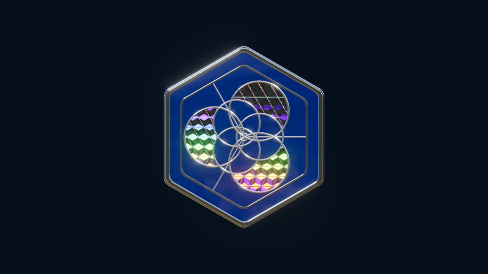

# 珐琅徽章



[在线体验](https://2233admin.github.io/design-pipeline/enamel-badge/) · [项目主页](../../README.md) · [第三方来源与许可](THIRD_PARTY_NOTICES.md)

一个可拖动查看的 WebGL 珐琅徽章：蓝色釉面、银色掐丝与边框、六向刻纹虹彩箔片，以及覆盖在表面的凸透镜。默认页面只展示作品；开发结构视图按需打开。

## 本地运行

在仓库根目录使用 Node.js 22+，无需安装额外依赖：

```sh
node examples/enamel-badge/serve.cjs
```

打开 <http://127.0.0.1:47832/>。可通过 `PORT` 环境变量修改端口，例如在 PowerShell 中：

```powershell
$env:PORT = '47833'
node examples/enamel-badge/serve.cjs
```

所有运行模块与 HDR 均随案例本地提供。浏览器需支持 WebGL 2；实时焦散还需要浮点渲染目标扩展，缺少该扩展时焦散不启用。

## 操作

- 拖动徽章：查看不同角度的反射与变色。
- 点击播放按钮，或选中徽章后按空格：播放、暂停演示。
- 点击重置按钮或按 `R`：恢复初始姿态。
- 在地址后加 `?inspect=1`：查看开发用分层、视角与灯光控制，例如 <http://127.0.0.1:47832/?inspect=1>。

## 实现与制作记录

这份公开版本保留本地研究第 7 版（v7）的渲染参数。基底采用 Three.js 0.180.0 的 PBR 材质；虹彩箔片结合改编的解析光栅模型与原生薄膜干涉，透镜结合曲面入射、平面出射和原生三通道色散。自然光 HDR、Bloom、MSAA 与 SMAA 构成照明及后处理。

实际实现入口是 [badge.mjs](badge.mjs)。[lib/diffraction.mjs](lib/diffraction.mjs)、[lib/lens.mjs](lib/lens.mjs) 和 [lib/caustics.mjs](lib/caustics.mjs) 保留各自的来源、改编范围和限制；Three.js 核心及原生后处理模块在本案例内提供。

制作作者为当前会话 **Codex**，运行环境未向会话暴露精确模型 ID，因而不能把本案例归因于某个未经确认的型号。作品经过用户多轮指出并修正虹彩花纹、透镜放大、色散、辉光、自然光 HDR 与抗锯齿问题。它不代表模型一次自动复刻，也不能单凭此案例证明工具对所有模型的效果都有提升。

[demo-motion.json](demo-motion.json) 是人工估计的演示姿态数值，用于播放交互动画；没有精确解算参考片运动。公开包不包含原参考视频、从原片抽取的截图或原片音频；上方预览由这份实现实际渲染。

## 已知限制

- 采用实时光栅渲染，**不是路径追踪（PT）**。有 PBR 基底不等于完整、测量准确的光学模拟。
- 透镜以单个平面接收背景，没有侧壁求交、内部多次反射或多深度遮挡。色散使用 Three.js 的三通道折射率近似，没有复用上游完整八波长追踪器。
- 焦散使用单次折射与平面接收器近似，没有完整光谱传输、出射界面和遮挡求解。
- 光栅及薄膜参数用于视觉校准，未经真实材质测量。用户仍指出玻璃与参考效果存在误差，曲率和色散需要继续校对。

代码可运行、公开发布和技术检查均不代表视觉验收通过；这是一份仍可迭代的作品研究。

## 许可

本案例原创代码随项目采用 [MIT 许可](LICENSE)。第三方代码和 HDR 分别保留各自许可；完整来源与 SMAA 的独立许可见 [THIRD_PARTY_NOTICES.md](THIRD_PARTY_NOTICES.md)。
