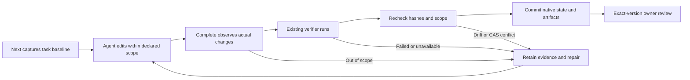

# Design

## Context

See proposal.md and the prior correctness audit. The missing links are between existing components, not a missing general-purpose runner:

| Existing seam | Observed behavior | Required connection |
| --- | --- | --- |
| `plan-core.cjs` visual task | Strict v1 paths for checks, scope and outputs; no executable check binding | Declare one supported verifier and its inputs/result path |
| `workflow-core.cjs` native completion | Validates artifact bytes and self-written passed reports | Require observed verifier results and an observed task delta |
| `cli-core.cjs` interaction verifier | Runs the existing capture kernel, then evaluates measurements | Invoke it from the public native completion operation |
| `execution-target-core.cjs` | Measures Git-visible changes and literal scopes; may remove a successful worktree | Share a pure inspection step without invoking cleanup |
| Native state/events and artifact.v1 | Current hashes, CAS, downstream invalidation and version-bound review | Store and revalidate the active baseline and observed completion |

`toolchain receipt-check` validates invocation fields, not their origin. Execution finalize genuinely measures Git changes but its invocation comes from caller outcome. Native visual plans do not necessarily have toolchain/execution plans. Neither receipt can be attached as a shortcut to execution proof. The case-specific `component-eval` capture/seal/complete flow is a useful reference, not a generic file scanner or required new dependency.

## Goals / Non-Goals

**Goals:** Close one local-web native task from dispatch to observed browser verification and per-task scope checking; retain failure context and exact-version review.

**Non-Goals:** Build an autonomous agent scheduler, execute arbitrary shell checks, import pstack wholesale, add generic framework adapters, change component-first pure gates, or authenticate local evidence against an agent with permission to rewrite the harness itself.

## Decisions

### 1. Keep completion as the authority and start with one verifier

Keep `next --change-root` and `decide ... --verdict complete`. Extend the existing strict visual object with a validated `verification` binding list. The first supported descriptor is `{ kind: "interaction", probe: "interaction.json", target: "index.html", check: "evidence/interaction-check.json" }`, with contained paths, `probe` declared in task inputs, `target` declared in task outputs and `check` declared in the existing checks array. Every required check must have a supported descriptor; unsupported or omitted descriptors block promotion. Existing report-only plans remain readable.

Extract capture/evaluate plus the shared path/collision preflight inside the existing CLI/module boundary. The legacy verify wrapper retains its fixed `outDir/interaction.json` write and project-root recordGate behavior. The native complete wrapper calls the same capture/evaluator with its exact declared report destination and commits only native progress. Before capture, check report identity against all bound inputs (including probe/references/guides), all declared outputs (including the measured page), other declared check destinations, the active plan and exact native state.json/events.jsonl paths, including hard-link/symlink aliases. Reuse the same inode loop; the existing legacy state guard alone does not protect native controls or other bound files. Calling the legacy wrapper wholesale would mutate a second workflow state and cannot be used as the native transaction.

The public complete handler obtains the real exit result and measurements itself, writes the designated existing interaction-result.v1 report and computes artifact.v1 metadata from the actual files. Native evidence validation dispatches to the existing result's status/probes/findings contract for this supported descriptor; it does not invent a `checks` array to make an interaction report resemble the legacy self-written report. It does not accept a report, receipt or `producer` string as proof of execution. No arbitrary command strings, project-script auto-discovery or recursive self-dispatch are introduced.

Resolve the probe's page with the existing resolvePageUrl and contained-path helpers. First-slice URLs must resolve to the declared local output target; remote URLs or other local pages block this binding. Include the probe in input hashes, the actual page in output hashes, and require capture's actual URL to match that target. A real check of other.html must not authorize index.html.

A declaration of success must never skip the verifier. A host-written record is useful for freshness on resume but is not a cryptographic trust boundary. The installed verifier and its selected tool dependencies are assumed trusted; project-owned adapter identity does not automatically confer trust.

### 2. Capture the task baseline before work and preserve it

Use the existing visualTasks extension to record the first dispatched attempt's task/plan hashes, resolved change root, observed Git root, branch, HEAD and file snapshot. Freeze the original task's literal authorization set (scope, exact outputs/checks and exact tool-owned control paths) in the active record as well; a hash alone cannot recover the old scope after a plan file is replaced. Preserve that active record on repeat next and failed verification. Missing or incompatible baselines require repair, not an inferred historical pass.

Extract shared Git change collection and literal-scope checking from execution-target-core; both its finalizer and native completion call the same inspection code. Add worktree content/type/status and Git index blob OID/mode/stage snapshots for the observed baseline and final state. Working bytes and porcelain status alone miss an index-only edit to a file that remains MM; unmerged index stages block completion. Enumerate all tracked and non-ignored untracked paths at each end, not just dirty names.

Also collect changed paths from every commit in the observed attempt window, including rename endpoints. The existing base..HEAD endpoint diff alone misses an out-of-scope commit followed by a revert commit. Require the frozen baseline HEAD to remain an observable ancestor on the bound branch; unverifiable history replacement blocks completion. Retain deletions, staged/unstaged changes, newly committed paths, links and mode changes. Do not follow file links out of the target while hashing; use link identity/content and the existing containment helpers.

Use an explicit owned execution window. In a shared directory, the tool can observe a delta but cannot attribute concurrent edits; it must report that uncertainty or block verified scope rather than accuse an agent. Non-Git targets cannot claim this scope check in the first slice. Git-ignored files, writes outside the repository and uncommitted transient writes restored before inspection are outside Git scope coverage; visible commit/revert history is included. Full write containment requires an independent host permission boundary.

### 3. Compare the current task's scope in the correct coordinates

Preserve native scope paths relative to changeRoot. Resolve them through the existing contained-path logic and map them explicitly into Git-root coordinates before using the existing literal-scope predicate. Do not silently reinterpret native paths as project-root paths or substitute the union of every task's scope.

The authorized set comprises this task's declared source scope and exact declared outputs/checks. Account separately for the exact harness-controlled state/event/metadata paths the operation writes, capturing the user-code delta before those writes. Do not whitelist an entire evidence or OpenSpec directory. Caller-supplied changedFiles never substitutes for observation.

Failed verification does not reset scope history. A new attempt window is allowed only after the previous window has passed scope inspection against its frozen original authorization or its unresolved change has been explicitly repaired; an out-of-scope edit must not become an accepted baseline by repeating next, rejecting a task or changing the plan. A plan change must close the prior window against the saved original authorization before adopting any expanded scope. After a completed, scope-checked task is rejected for rework, retain its prior evidence and bind a distinct new attempt.

### 4. Commit a single checked snapshot

Within completion: capture the current task/input/output hashes and native state hash; check the active baseline binding; inspect scope; run supported checks; recompute the hashes and scope; then create the existing artifact metadata and commit through existing native state/events CAS. Drift or CAS conflict leaves the attempt uncompleted with retained diagnostics. Do not bind post-capture replacement bytes as checked.

Use existing report/artifact forms and the visualTasks extension. A genuine routed toolchain/execution context may carry its existing receipt references and digests. Native-only execution does not emit a fake toolchain receipt or invent a toolchain-plan hash from a visual-plan hash.

On resume, existing currentVisual/markVisualStale revalidates the observed record and all bound files, and invalidates dependent review. Owner acceptance still applies only to the exact evidence version. Scope verification itself never performs worktree cleanup; preserve the actual output until evidence is sealed and any required review has finished. Existing finalizer cleanup behavior remains for its original callers.

### 5. Teach the actual loop through existing entry points

Next returns one concrete current action: repair a missing binding/baseline, work on the task, complete through the observed verification path, or review the checked output. Errors name the failed observation and exact repair. Extend existing stages and QA guidance with this loop and its measured coverage. pstack/Matt engineering methods guide task isolation, real verification and diagnosis; more prose cannot replace the completion guard.

## File ownership

- Runtime owner: existing plan, workflow, CLI and execution-target modules, plus the existing component-eval native consumer; reuse their helpers before introducing any new file.
- Test owner: existing workflow-next, interaction-cli/capture, execution-target and component-eval test files, including the existing native evaluation fixtures/consumer. Migrate report-only native evaluation examples to the supported local-web binding and observed completion without creating another runner. Preserve all previous regression coverage and unrelated edits; new test files require manifest registration.
- Guide owner: existing stages/QA checklist and their native-plan example. Change records stay here; proof logs stay in ignored .design-pipeline.
- Independent reviewers inspect completion authority, baseline preservation, root mapping, lineage and actual public CLI counterexamples.

## Compatibility and Migration

Preserve design-plan.v1, artifact.v1, native state/event schemas and existing receipt families. New optional data must be explicitly allowed and validated where strict validators apply. Old plans and completions remain readable; report-only or baseline-less passes become unverified/stale and require explicit supported bindings plus fresh dispatch/completion. Do not silently default a legacy report to a registered verifier. Existing project-root workflows and external pure evidence validators retain their behavior.

## Risks / Trade-offs

- Full Git-visible snapshots cost I/O: use existing SHA-256 and the smallest correct snapshot first; optimize only after measurement.
- Dirty or concurrent work cannot be inferred from a dirty boolean: preserve byte baselines and require an owned attempt; never reset or discard other people's files.
- Re-execution needs browser tools and time: missing tools return blocked with the existing recovery guidance; never substitute structural validation.
- Same-permission tampering can rewrite every local claim: reliable adversarial provenance requires independent host/CI re-execution on an exact snapshot with records the builder cannot rewrite. This local slice does not claim that security property.

## Rollout

Implement and verify one native local web task first, including the two original audit counterexamples. Expand to existing storyboard/render/edit checks only when their declared tasks and observed verdicts can use this same completion path. No generic adapter platform is required for the first slice.
